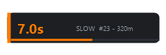
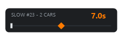

<p align="center">
  
</p>

<h1 align="center">OhShit</h1>

<p align="center"><strong>Early incident warning for iRacing — a SimHub plugin + overlay.</strong></p>

<p align="center">
  <a href="https://github.com/thomasfowler/OhShit-Releases/releases/latest"></a>
  <a href="https://github.com/thomasfowler/OhShit-Releases/releases"></a>
  <a href="https://discord.gg/BKCMK9fWxE"></a>
</p>

---

Yellow flags are late. The telemetry isn't: when a car ahead suddenly drops off the pace it
should be keeping, or leaves the racing surface and slows, there is shit ahead. OhShit watches
every car ahead of you and shows a countdown — yellow → amber → red — of seconds (and meters)
until you arrive at the mess.

## Quickstart

1. **[Download the latest installer](https://github.com/thomasfowler/OhShit-Releases/releases/latest)** — `OhShit-Setup-<version>.exe`.
2. **Run it.** Windows SmartScreen will probably object — the installer isn't code-signed, so
   Windows doesn't recognize the publisher. Click **More info → Run anyway**.
3. **Click install.** It finds your SimHub, closes it if it's running, and installs the plugin
   and overlay.
4. **Fire up SimHub** — click **yes** when it asks about the new OhShit plugin.
5. **Add the overlay**: Dash Studio → Overlays → **OhShit**, and place it on screen.
6. **Done.** Go drive. When there's shit ahead, you'll know before the flags do.

## What it does

- **Learns the track live.** Normal pace for every part of the circuit is learned from the
  field as you race, so slow corners don't false-alarm but a car crawling on a straight does.
- **Works cold too.** Before pace is learned, stopped cars, beached/off-track cars and anything
  crawling on-track still trigger.
- **Knows when not to shout.** Cars in the pits, parade laps, race-start crawls (while still
  catching lap-1 pileups), full-course cautions and momentary off-tracks are all ignored.
- **Audio countdown.** Rising tones as you close in on the incident — audio and overlay toggle
  independently, so audio-only works.
- **Won't hurt your frame rate.** A guarded, allocation-free update path with a circuit
  breaker; the plugin publishes its own per-frame cost so you can check it.

## The overlay

One overlay, four looks — switchable live from the settings page:

| Strip | Ribbon |
| :---: | :---: |
|  |  |
| **Beacon** | **Banner** |
|  |  |

Plus toggles for a depleting distance bar, multi-car chip, red-level pulse, and progressive
sizing — and the countdown can read seconds, meters, or both.

## Requirements

- Windows with [SimHub](https://www.simhubdash.com/) installed (tested on 9.11.x)
- [iRacing](https://www.iracing.com/) — OhShit reads iRacing telemetry only and stays idle in
  other titles

## Good to know

**Missed the enable prompt?** SimHub only asks about a new plugin once — turn OhShit on any
time under Settings → Plugins.

**Try it without driving:** open the OhShit page in SimHub's left menu and set
**PREVIEW / SCREENSHOT MODE** to *Cycle* — the overlay runs through its warning levels with no
game running, so you can position and style it before you're on track. It switches itself off
after 15 minutes.

**Updating**: the plugin checks this repository's releases feed once when SimHub starts
(and on demand from its settings page) and offers new versions there — download, checksum
verification and the installer run are all one click. It's a single anonymous web request;
untick *Check for updates when SimHub starts* on the OhShit settings page for no network
calls at all. Running a newer installer by hand upgrades in place too. **Uninstalling** is
Apps & Features → OhShit; it removes the plugin and its overlay and leaves the rest of your
SimHub alone.

<details>
<summary>Verifying your download</summary>

Every release ships a `.sha256` next to the installer:

```powershell
(Get-FileHash .\OhShit-Setup-0.9.2.exe -Algorithm SHA256).Hash -eq (Get-Content .\OhShit-Setup-0.9.2.exe.sha256).Split()[0]
```

`True` means the file is intact.
</details>

## Bugs & support

- **Something broken?** [Open an issue](https://github.com/thomasfowler/OhShit-Releases/issues)
  — the template asks for the few details that make bugs findable, most importantly the
  `[OhShit]` lines from your SimHub log (`SimHub\Logs\SimHub.txt`). Every warning the plugin
  raises, and every reason it stays quiet, is logged there.
- **Questions, setup help, or just want to chat?** Join the
  [JT-Racing Discord](https://discord.gg/BKCMK9fWxE).

If nothing seems to happen on track, check the **Status** chip on the OhShit settings page
first — it says exactly why detection is idle (`NoGame`, `NotIRacing`, `OK`, ...).

## About

OhShit is closed-source; this repository hosts the released binaries, documentation and issue
tracker. The binaries are released into the public domain — see [LICENSE](LICENSE).

<p align="center">
  <a href="https://jt-racing.net/">
    <picture>
      <source media="(prefers-color-scheme: dark)" srcset="assets/jt-racing-dark.png" />
      
    </picture>
  </a>
</p>

<p align="center">Built by <a href="https://jt-racing.net/">JT-Racing</a> · <a href="https://discord.gg/BKCMK9fWxE">Discord</a></p>
